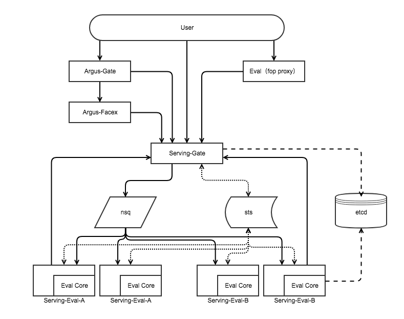

<!-- START doctoc generated TOC please keep comment here to allow auto update -->
<!-- DON'T EDIT THIS SECTION, INSTEAD RE-RUN doctoc TO UPDATE -->
**Table of Contents**  *generated with [DocToc](https://github.com/thlorenz/doctoc)*

- [服务定义](#%E6%9C%8D%E5%8A%A1%E5%AE%9A%E4%B9%89)
- [架构设计](#%E6%9E%B6%E6%9E%84%E8%AE%BE%E8%AE%A1)
  - [服务入口架构](#%E6%9C%8D%E5%8A%A1%E5%85%A5%E5%8F%A3%E6%9E%B6%E6%9E%84)
  - [管理入口架构](#%E7%AE%A1%E7%90%86%E5%85%A5%E5%8F%A3%E6%9E%B6%E6%9E%84)
- [API定义](#api%E5%AE%9A%E4%B9%89)
  - [Serving-Gate API（基本规格）](#serving-gate-api%E5%9F%BA%E6%9C%AC%E8%A7%84%E6%A0%BC)
    - [URI请求，返回元数据](#uri%E8%AF%B7%E6%B1%82%E8%BF%94%E5%9B%9E%E5%85%83%E6%95%B0%E6%8D%AE)
    - [URI请求，返回二进制](#uri%E8%AF%B7%E6%B1%82%E8%BF%94%E5%9B%9E%E4%BA%8C%E8%BF%9B%E5%88%B6)
    - [批量请求，返回元数据](#%E6%89%B9%E9%87%8F%E8%AF%B7%E6%B1%82%E8%BF%94%E5%9B%9E%E5%85%83%E6%95%B0%E6%8D%AE)
    - [Body请求，返回元数据（方便测试）](#body%E8%AF%B7%E6%B1%82%E8%BF%94%E5%9B%9E%E5%85%83%E6%95%B0%E6%8D%AE%E6%96%B9%E4%BE%BF%E6%B5%8B%E8%AF%95)
    - [Body请求，返回二进制（方便测试）](#body%E8%AF%B7%E6%B1%82%E8%BF%94%E5%9B%9E%E4%BA%8C%E8%BF%9B%E5%88%B6%E6%96%B9%E4%BE%BF%E6%B5%8B%E8%AF%95)
  - [Serving-Gate API（通用模板）](#serving-gate-api%E9%80%9A%E7%94%A8%E6%A8%A1%E6%9D%BF)
    - [分类网络](#%E5%88%86%E7%B1%BB%E7%BD%91%E7%BB%9C)
    - [检测网络](#%E6%A3%80%E6%B5%8B%E7%BD%91%E7%BB%9C)
    - [分割网络](#%E5%88%86%E5%89%B2%E7%BD%91%E7%BB%9C)
- [网络推理脚本](#%E7%BD%91%E7%BB%9C%E6%8E%A8%E7%90%86%E8%84%9A%E6%9C%AC)
  - [网络初始化](#%E7%BD%91%E7%BB%9C%E5%88%9D%E5%A7%8B%E5%8C%96)
  - [网络推理](#%E7%BD%91%E7%BB%9C%E6%8E%A8%E7%90%86)
- [发布管理](#%E5%8F%91%E5%B8%83%E7%AE%A1%E7%90%86)
  - [发布基本流程](#%E5%8F%91%E5%B8%83%E5%9F%BA%E6%9C%AC%E6%B5%81%E7%A8%8B)
  - [Dora2操作手册](#dora2%E6%93%8D%E4%BD%9C%E6%89%8B%E5%86%8C)
  - [Serving发布相关配置](#serving%E5%8F%91%E5%B8%83%E7%9B%B8%E5%85%B3%E9%85%8D%E7%BD%AE)
    - [发布配置](#%E5%8F%91%E5%B8%83%E9%85%8D%E7%BD%AE)

<!-- END doctoc generated TOC please keep comment here to allow auto update -->

# 服务定义

可持续交付的、高效的AI推理服务集群。

* 原子推理语义
* 持续交付
* 高效集成
* 可运维、健壮的、高效的分布式系统

# 架构设计

[架构设计文档](https://cf.qiniu.io/pages/viewpage.action?pageId=17659603)
## 服务入口架构


## 管理入口架构
TODO

# API定义
## Serving-Gate API（基本规格）

基本语义说明

* 输出类型：元数据（JSON)、二进制（图片等）
* 任务输入数据量：single（一张图，比如获取分类结果）、group（多张图片，比如人脸相识度）
* 批量：单任务、批量任务
* 指定版本
	* 指定版本情况下，会由对应的服务实例进行推理服务
	* 无指定版本情况下，会由所有的确定发布的服务实例进行推理服务 
* 资源表示方式（URI）。通过统一方式定位、获取资源（图片、二进制数据等）
	* HTTP， 网络资源，形如：`http://host/path`、`https://host/path`
	* Qiniu，存储在Qiniu KODO的文件资源，形如：`qiniu://[uid@]zone/bucket/key`
	* Data，Data URI Scheme形态的二进制文件，形如：`data:application/octet-stream;base64,xxx`。ps: 当前只支持前缀为`data:application/octet-stream;base64,`的数据

| NOTE | PATH | Request Type | Response Type |
| :--- | :--- | :---: | :---: |
| [URI请求，返回元数据](#URI请求，返回元数据) | `/v1/eval/<eval cmd>[/<version>]` | Json | Json |
| [URI请求，返回二进制](#URI请求，返回二进制) | `/v1/eval/<eval cmd>[/<version>]` | Json | stream |
| [批量请求，返回元数据](#批量请求，返回元数据) | `/v1/batch` | Json Array | Json Array |
| [Body请求，返回元数据（方便测试）](#Body请求，返回元数据（方便测试）) | `/v1/eval/<eval>[/<version>]` | stream | Json |
| [Body请求，返回二进制（方便测试）](#Body请求，返回二进制（方便测试）) | `/v1/eval/<eval>[/<version>]` | stream | stream |

### URI请求，返回元数据
Request

```
POST /v1/eval/<eval cmd>[/<version>]
Content-Type: application/json

{
	"data": {
		"uri": <uri:string>,   // 资源文件
		"attribute": {}        // 补充信息
	},
	"params": {}               // 额外参数
}
```
or

```
POST /v1/eval/<eval cmd>[/<version>]
Content-Type: application/json

{
	"data": [
		{
			"uri": <uri:string>,   // 资源文件
			"attribute": {}        // 补充信息
		},
		...
	]
	"params": {}                   // 额外参数
}
```

Response

```
200 OK
Content-Type: application/json

{
	"code": 0,
	"message": "...",
	"result": {...}
}
```

### URI请求，返回二进制
Request

```
POST /v1/eval/<eval cmd>[/<version>]
Content-Type: application/json

{
	"data": {
		"uri": <uri:string>,   // 资源文件
		"attribute": {}        // 补充信息
	},
	"params": {}               // 额外参数
}
```
or

```
POST /v1/eval/<eval cmd>[/<version>]
Content-Type: application/json

{
	"data": [
		{
			"uri": <uri:string>,   // 资源文件
			"attribute": {}        // 补充信息
		},
		...
	]
	"params": {}                   // 额外参数
}
```

Response

```
200 OK
Content-Type: application/octet-stream

...
```

### 批量请求，返回元数据
Request

```
POST /v1/batch
Content-Type: application/json

[
	{
		"op": "/v1/eval/<cmd>[/<version>]",
		"data": {
			"uri": <uri:string>,   // 资源文件
			"attribute": {}        // 补充信息
		},
		"params": {}               // 额外参数
	},
	{
		"op": "/v1/eval/<cmd>[/<version>]",
		"data": [
			{
				"uri": <uri:string>,   // 资源文件
				"attribute": {}        // 补充信息
			},
			...
		],
		"params": {}               // 额外参数
	},
	...
]
```

Response

```
200 OK
Content-Type: application/json

[
	{
		"code": 0,
		"message": "...",
		"result": {...}
	},
	...
]
```

### Body请求，返回元数据（方便测试）
Request

```
POST /v1/eval/<eval cmd>[/<version>]
Content-Type: application/octet-stream

...
```

Response

```
200 OK
Content-Type: application/json

{
	"code": 0,
	"message": "...",
	"result": {...}
}
```

### Body请求，返回二进制（方便测试）
Request

```
POST /v1/eval/<eval cmd>[/<version>]
Content-Type: application/octet-stream

...
```

Response

```
200 OK
Content-Type: application/octet-stream

...
```

## Serving-Gate API（通用模板）

| NOTE | PATH | Request Type | Response Type |
| :--- | :--- | :---: | :---: |
| [分类网络](#分类网络) | `/v1/eval/<classify cmd>` | Json | Json |
| [检测网络](#检测网络) | `/v1/eval/<detection cmd>` | Json | Json |
| [分割网络](#分割网络) | `/v1/eval/<segmentation cmd>` | Json | Json |

### 分类网络
Request

```
{
	"data": {
		"uri": <uri:string>   // 资源文件
	},
	"params": {
		"limit": <limit:int>
	}
}
```

Response

```
{
	"code": 0,
	"message": "...",
	"result": {
		"confidences": [
			{
				"index": <index:int>,
				"class": <class:string>,
				"score": <score:float>
			},
			...
		]
	}
}
```

### 检测网络
Request

```
{
	"data": {
		"uri": <uri:string>   // 资源文件
	}
}
```

Response

```
{
	"code": 0,
	"message": "...",
	"result": {
		"detections": [
			{
				"pts": [[<uint>, <uint>], [<uint>, <uint>], ...],
				"index": <index:int>,
				"class": <class:string>,
				"score": <score:float>
			},
			...
		]
	}
}
```

### 分割网络
Request

```
{
	"data": {
		"uri": <uri:string>   // 资源文件
	}
}
```

Response

```
{
	"code": 0,
	"message": "...",
	"result": {
		"mask": "data:image/png;base64,...",
		"detections": [
			{
				"index": <index:int>,
				"class": <class:string>,
				"color": [uint, uint, uint],
				"pts": [[<uint>, <uint>], [<uint>, <uint>], ...],
				"score": <score:float>
			},
			...
		]
	}
}
```

# 网络推理脚本
## 网络初始化

**函数名**
```
net_init(cfg)
```

**参数**
```
cfg: {
	'tar_files': {
		'deploy.prototxt': <prototxt local file path>,
		'weight.caffemodel': <caffemodel local file path>,
		'mean.binaryproto': <mean local file path|optional>,
		'labels.csv': <synset local file path|optional>,
		...
	},
	'image_width': <image width>,
	'use_device': <CPU/GPU>,
	'batch_size': <batch size|optional>,
	'custom_files': {
		'taglist_file': <taglist local file path|optional>,
		...
	},
	'custom_values': {
		'threshold': <detect threshold>,
		'workspace': <stream file workspace>,
		...
	}
}
```

**返回值**
```
model: {
	"error": <initialization error msg>,
	"net": <initialized net>,
	"transformer": <image transformer|optional>,
	"batch_size": <net batch size>,
	"synset_list": <synset list|optional>,
	"tag_dict": <taglist dict|optional>,
	...
}
```

## 网络推理

**函数名**
```
net_inference(model, args)
```

**参数**
```
model: <net model created by net_init()>
args: {
	"reqid": <request id>,
	"reqs": [
		{ 
			"data": {
				"uri": <image uri>,
				"attribute": <image attribute|optional>,
			},
			"params": <req params|optional>
		},
		...
	]
}
```

**返回值**
```
ret: [
	{
		"code": <error code>,
		"message": <error message>,
		"result": <json result>,
		"result_file": <stream result>,
		...
	},
	...
]
```
***code:***

 错误码参见[链接](../docker/scripts/atserving/error.py)

# 发布管理
## 发布基本流程
1. 前期准备基础镜像（根据训练的支持，准备对应的镜像），提交Dora2镜像库。
2. 调用serve，指定`appName`、`appVersion`
3. 测试，通过指定VERSION进行测试评估。
4. 正式上线，调用server，指定`phase=production`

## Dora2操作手册

[Dora2 UFOP 文档](https://developer.qiniu.com/dora/manual/1648/dora-customized-data-process)

## Serving发布相关配置

### 发布配置
KEY ```/ava/serving/eval/<appName>/<appVersion>```

VALUE

```
{
	"name": <name:string>,
	"version": <version:string>,
	"file": <URI:string>, // 模型文件tar包
	"phase": <phase:string>,
	"desc": <desc:string>,
	"lastmodified": <lastmodified:time>
}
```