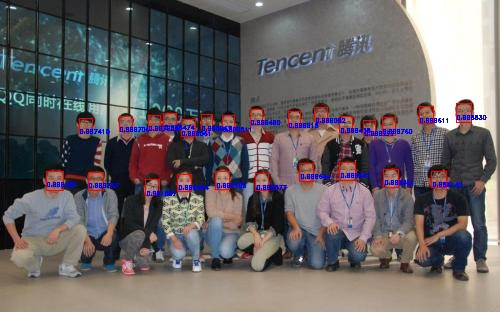

# Face-Detection
____________

## 使用方式

### 0. 按照Troan-Shadow的README安装相关依赖

### 1. 在FaceDetection目录下执行以下命令编译项目

```Shell
mkdir build
cd build
cmake ..
make
```

### 2. 下载[TensorRT版的 人脸检测及质量评估模型及测试图像](http://pbv7wun2s.bkt.clouddn.com/tron_fd_quality_models_testimgs.zip) ，同样解压到刚刚建立的build目录下


### 3. 执行./main X 执行网络测试，X=1表示生成bin文件（第一次执行必须生成），不输出X表示不生成


### 结果




#### 时间对比（纯推理时间）

Caffe-depth:
Average Forward pass: 48.5526 ms.

Caffe-conv:
Average Forward pass: 106.842 ms.

Tensor-depth:
infer time per image: 18.426 ms

Tensor-conv:
infer time per image: 10.5 ms


