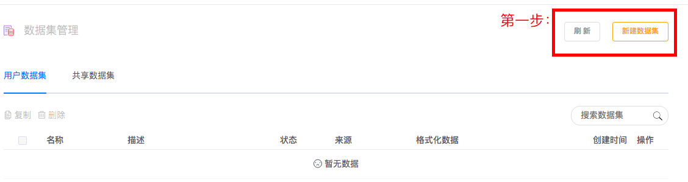
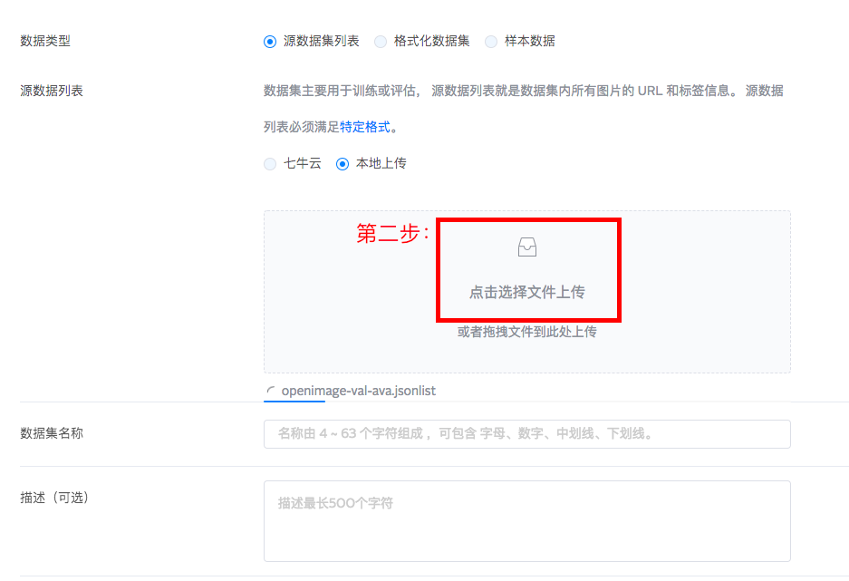
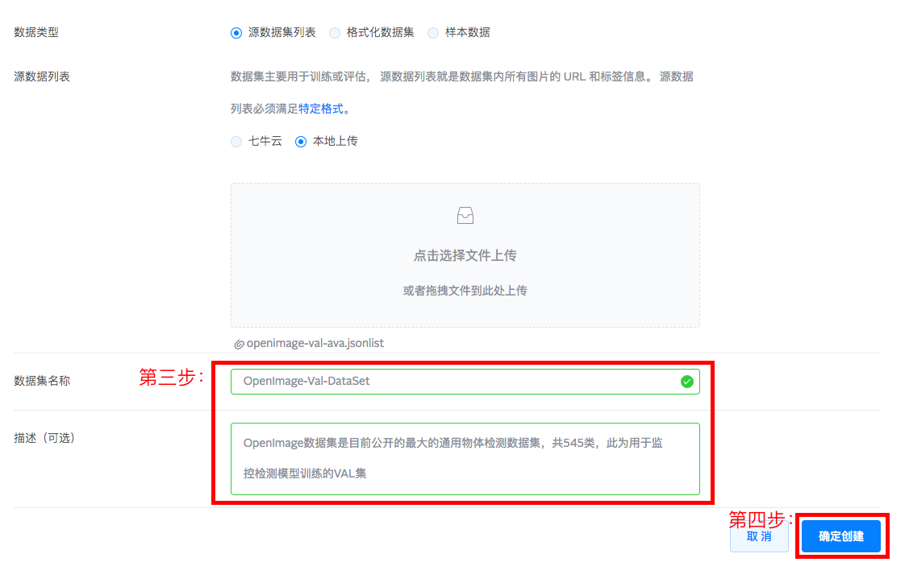
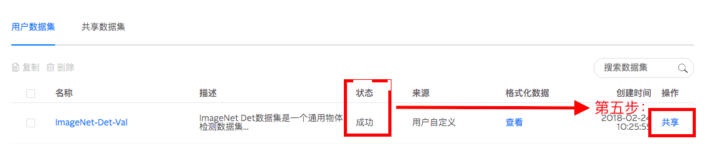
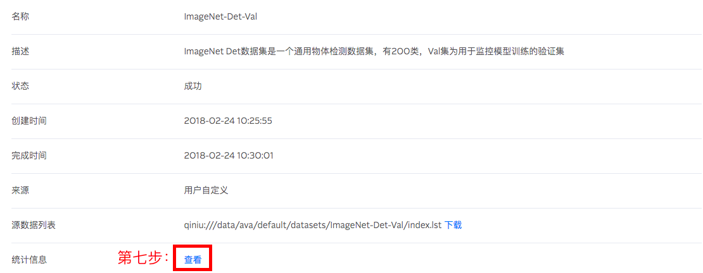
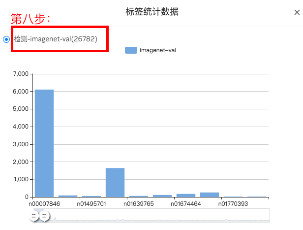

# AVA数据集构建

### 说明
预备姿势：在完成目标数据集上传、生成标准jsonlist后，可以在AVA平台完成目标数据集的构建，具体步骤如下：

* 第一步：点击“新建数据集”

* 第二步：选择“原数据集列表”选项，点击上传目标数据集的jsonlist

* 第三、四步：填写数据集名称与描述（可选），点击“确定创建”

* 第五步：数据集创建状态显示成功后，点击“共享”（敏感数据集请忽略此步骤）

* 第六步：核实共享数据集名称后，点击“确定”

### 安全检查
为了防止数据集构建过程中出现文件缺失，按下述步骤完成数据集文件数目的检查：

* 第七步：点击统计信息一栏中的”查看“

* 第八步：核实数据集样本数目（Object数目）与本地自测数目一致
