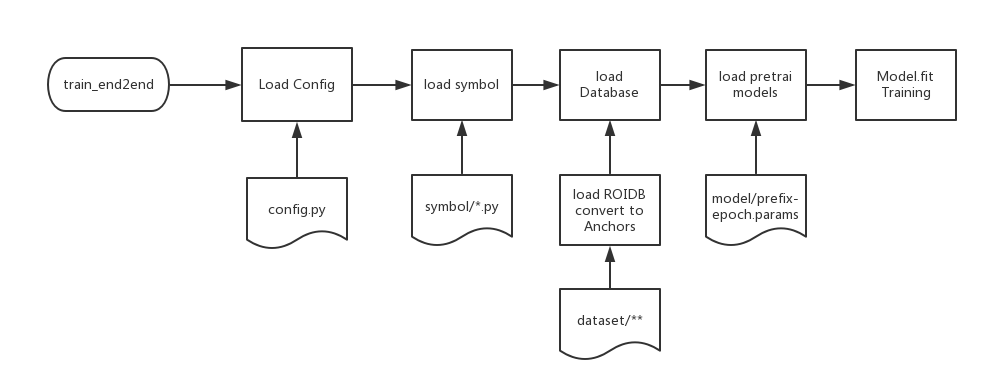

# Mxnet 添加新的数据集
## Mxnet RCNN example框架
Traing 流程图：

### 关键点介绍
1. 整个RCNN example框架依托于Mxnet的框架
2. Mxnet框架中每个Module会在fit函数中自动调用 `forward` ， `backward` 和 `update` 函数完成训练
3. 框架中`rcnn/core` 文件夹下实现的是整个流程框架的控制，当需要添加一些新的模型或者是数据库时，无需改动流程框架，只要在对应的文件夹下添加对应的文件即可

### 添加新的数据库
添加新的数据库的步骤包括：

* 在 `rcnn/dataset` 下新建一个数据库名的 python 文件。并在 `__init__.py` 中添加对于该文件的引用

* 在新建的python 文件实现几个关键的接口：
 	* `gt_roidb` 此接口用了实现从数据的读取，包括读取所有的训练文件的标注文件,其中要注意的所有文件的路径是否正确，imagelist的格式是否正确等，特别注意的是Imagenet数据库标注的坐标为[0，imagesize],需要转换为[0,imagesize-1]
	* `evaluate_detections` 该接口实现的是将计算所得到的结果与标定的值计算得到最后的mAP值，实现的时候也需要注意各种标注的路径问题

* 在`config.py`中添加相应的配置项，设置初始化的数据库位置，数据库名字等一系列的信息

* 在运行`train_end2end.py` 的 `--network` 中写入新建的数据库名称即可使用新添加的数据库。

### 添加新的模型类型
添加新的模型类型步骤包括：

* 在`rcnn/symbol/` 文件夹下添加对应的python 文件并添加引用到`rcnn/symbol/__init__.py`中

* 实现几个关键接口：
	
	* `get_inceptionresnet_train` 实现训练时候提取从输入图片到RPN 到最后输出的框和类别信息的全过程，注意：这里的Layer的名字要于读取的PreTrain 的模型中的Layer的名字保持一致才能读取，所有在实现的时候要注意名字的对应。
	* `get_inceptionresnet_test` 对应测试时候模型的结构，与训练时候比较类似，对应即可

* 在 `config.py` 中 `network` 变量下添加对应 `net.XX.`的配置项，指定PreTraing的模型的前缀和epoch 的值，方便找到 `model` 下的模型文件

* 运行时通过 `--network` 指定添加的模型的类型

