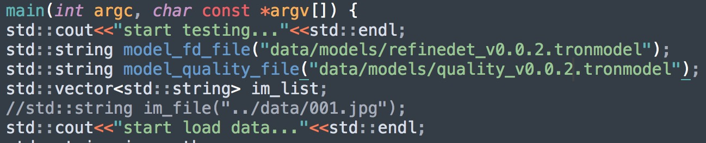

# Atlab Inference for Face-detection&Face-quality

## 将测试图片和模型放到相应位置下

    ```
    data/ 存放回归测试图片（>=30）
    ├── models/refinedet_v0.0.3.tronmodel      人脸检测模型
    ├── models/quality_v0.0.3_merged.tronmodel 质量评估模型
    ├── models/orientation_v0.0.3_merged.tronmodel 方向回归模型
    ```
模型链接@:zhangweidong@qiniu.com

[回归用例](http://p0my22fmi.bkt.clouddn.com/facedet-datav2.zip)

## 修改tron/examples and infer_detection测试脚本（分别对应算法回归测试，交付镜像回归测试）

    ```
    修改待测图片和模型路径
    ```

## 编译子工程Shadow及推理工程Tron
1. 运行一键编译脚本

    ```
    sh scripts/build_shell.sh
    ```

## 运行

    ```
    ./build/tron/test_tron
    ```
## 配置项

 const std::string custom_params=R"({"gpu_id": 0,"const_use_quality": 1,"blur_threshold": 0.98,"output_quality_score": 1, "rip_filter_type": 1})";</br>
 "const_use_quality"    :1,       全局参数，使用质量评估;</br>
 "blur_threshold"       :0.98,       模糊阈值;</br>
 "output_quality_score" :1,       输出质量评估分数;</br>
 "rip_filter_type"      :1,       方向回归模型的配置参数，0不配置，1只回归clear，2回归所有人脸的;</br>


检查结果是否正确
## 请求格式
### request
```json
{
    "data": {
        "uri": "<uri:string>",
        }
}
```
## 返回结果格式格式
1. 通用检测
    "pts"             人脸框坐标
    "quality"         人脸质量类别
    "orientation"     人脸方向，0-2PI
    
开启质量评估和方向回归 结果如下：
    
```json
{
   "detections":[  
      {  
         "index":1,
         "score":0.8794293403625488,
         "class":"face",
         "pts":[  
            [  
               413,
               496
            ],
            [  
               513,
               496
            ],
            [  
               513,
               560
            ],
            [  
               413,
               560
            ]
         ],
         "quality":"pose",
         "orientation":0.6176170110702515
      }
    ]
}
```
 未开启质量评估后并输出质量评分 结果如下：
  ```json
{
   "detections":[  
      {  
         "index":1,
         "score":0.8794293403625488,
         "class":"face",
         "pts":[  
            [  
               413,
               496
            ],
            [  
               513,
               496
            ],
            [  
               513,
               560
            ],
            [  
               413,
               560
            ]
         ]
      }
    ]
}
```
## 使用心得
多张图片不同角度的回归测试
