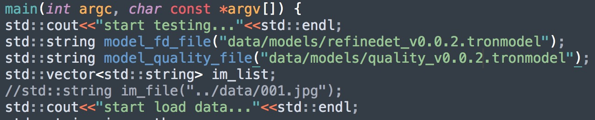

# Atlab Inference for Face-detection&Face-quality

## 将测试图片和模型放到相应位置下

    ```
    data/ 存放回归测试图片（>=30）
    ├── models/refinedet_v0.0.2.tronmodel      人脸检测模型
    ├── models/quality_v0.0.1_merged.tronmodel 质量评估模型
    ```
模型链接@:zhangweidong@qiniu.com

[回归用例](http://p9s1ibz34.bkt.clouddn.com/face-detection-quality-v0.0.2-18-06-15-QA.zip)

## 修改tron/examples and infer_detection测试脚本（分别对应算法回归测试，交付镜像回归测试）

    ```
    修改待测图片和模型路径
    ```

## 编译子工程Shadow及推理工程Tron
1. 运行一键编译脚本

    ```
    sh scripts/build_shell.sh
    ```

## 运行

    ```
    ./build/tron/test_tron
    ```
## 配置项

 const std::string custom_params=R"({"gpu_id": 0,"const_use_quality": 1,"blur_threshold": 0.98,"output_quality_score": 1})";</br>
 "const_use_quality"    :1,       全局参数，使用质量评估;</br>
 "blur_threshold"       :0.98,       模糊阈值;</br>
 "output_quality_score" :1,       输出质量评估分数;</br>

检查结果是否正确
## 返回结果格式范例
1. 通用检测
    "pts"             人脸框坐标
    "quality"         人脸质量类别
    "orientation"     人脸方向
    
未开启质量评估 结果如下：
    
```json
{
    "detections":[
        {
            "index":1,
            "score":0.9999877214431763,
            "class":"face",
            "pts":[
                [
                    827,
                    5
                ],
                [
                    995,
                    5
                ],
                [
                    995,
                    190
                ],
                [
                    827,
                    190
                ]
            ],
            "quality":"blur",
            "orientation":"up"
        }
    ]
}
```
 开启质量评估后并输出质量评分 结果如下：
  ```json
{
    "detections":[
        {
            "index":1,
            "score":0.9999877214431763,
            "class":"face",
            "pts":[
                [
                    827,
                    5
                ],
                [
                    995,
                    5
                ],
                [
                    995,
                    190
                ],
                [
                    827,
                    190
                ]
            ],
            "quality":"clear",
            "orientation":"up",
            "q_score":{
                "clear":0.9935269355773926,
                "blur":0.0000024897019557101885,
                "neg":0.0009634203161112964,
                "cover":0.0004839258617721498,
                "pose":0.005023303907364607
            }
        }
    ]
}
```
## 使用心得
多张图片的回归测试
