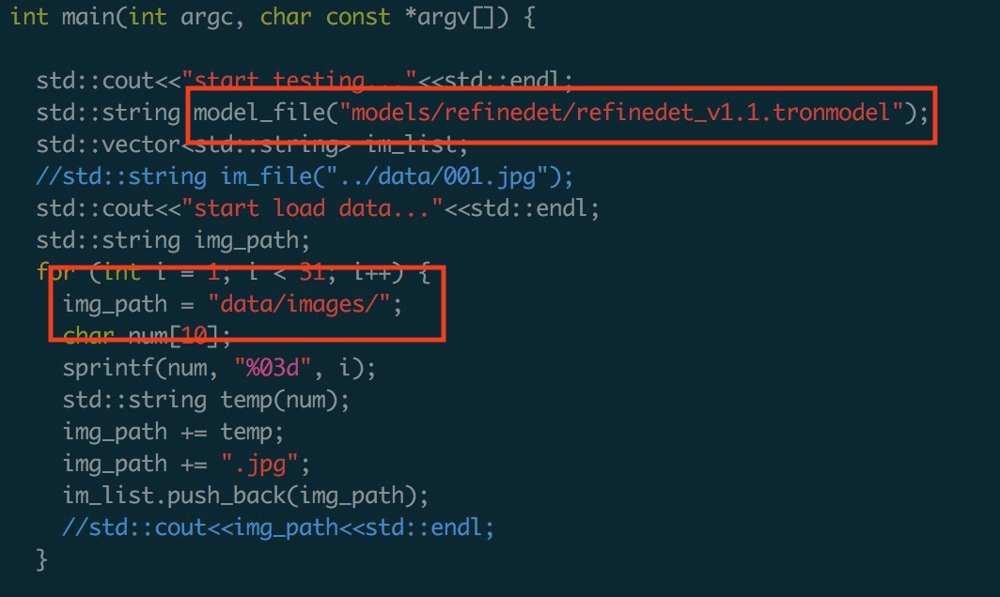

# Atlab Inference for Face-detection

## 将测试图片和模型放到相应位置下

    ```
    data/images 存放回归测试图片（>=30）
    models/refinedet_v1.1.tronmodel 存放tron模型
    ```
[模型链接](http://p0kj02jz5.bkt.clouddn.com/refinedetv1_models.zip)

[回归用例](http://p0kj02jz5.bkt.clouddn.com/refinedet_images.zip)

## 修改tron/examples and infer_detection测试脚本（分别对应算法回归测试，交付镜像回归测试）

    ```
    修改待测图片和模型路径
    ```

## 编译子工程Shadow及推理工程Tron
1. 运行一键编译脚本

       ```
       sh scripts/build_shell.sh
       ```

## 运行

    ```
    ./build/tron/test_tron
    ```

检查结果是否正确
## 返回结果格式范例
1. 通用检测

    ```json
    {
        "detections": [
            {
                "index": 1,
                "score": 0.997133,
                "pts": [[225,195], [351,195], [351,389], [225,389]]
            },
            ...
        ]
    }
    ```
## 使用心得
一定要做多张图片的回归测试
