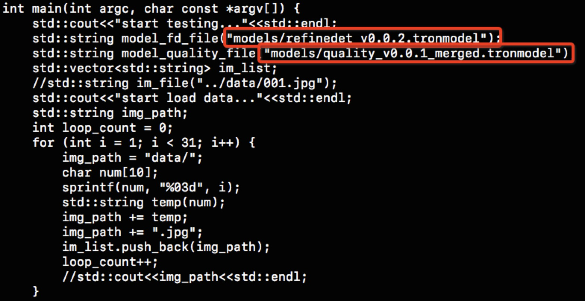

# Atlab Inference for Face-detection&Face-quality

## 将测试图片和模型放到相应位置下

    ```
    data/ 存放回归测试图片（>=30）
     models/refinedet_v0.0.2.tronmodel      人脸检测模型
     models/quality_v0.0.1_merged.tronmodel 质量评估模型
    ```
模型链接@:nihuajian@qiniu.com

[回归用例](http://p9s1ibz34.bkt.clouddn.com/face-detection-quality-v0.0.2-18-06-15-QA.zip)

## 修改tron/examples and infer_detection测试脚本（分别对应算法回归测试，交付镜像回归测试）

    ```
    修改待测图片和模型路径
    ```

## 编译子工程Shadow及推理工程Tron
1. 运行一键编译脚本

    ```
    sh scripts/build_shell.sh
    ```

## 运行

    ```
    ./build/tron/test_tron
    ```
## 配置项

 const std::string custom_params=R"({"gpu_id": 0,"use_quality": 1,"blur_threshold": 0.98,"output_pts5": 1})";

 "use_quality":1,       使用质量评估
 "blur_threshold":0.98, 模糊阈值
 "output_pts5":1,       输出五点定位信息

检查结果是否正确
## 返回结果格式范例
1. 通用检测

    ```json
    "pts"      人脸框坐标
    "quality"  人脸质量类别
    "pts5"     五点定位信息
    未开启质量评估 结果如下：
    {"detections":[{"index":1,"score":0.9999877214431763,"class":"face","pts":[[827,5],[995,5],[995,190],[827,190]]}]}

    开启质量评估后并输出五点定位 结果如下：
    {"detections":[{"index":1,"score":0.9999877214431763,"class":"face","pts":[[827,5],[995,5],[995,190],[827,190]],"quality":"clear","pts5":[[862.3526611328125,71.51605224609375],[936.4976806640625,68.14436340332031],[894.08544921875,102.32788848876953],[875.6483764648438,144.3836669921875],[931.7147827148438,141.82630920410157]]}]}
    ```
## 使用心得
一定要做多张图片的回归测试
